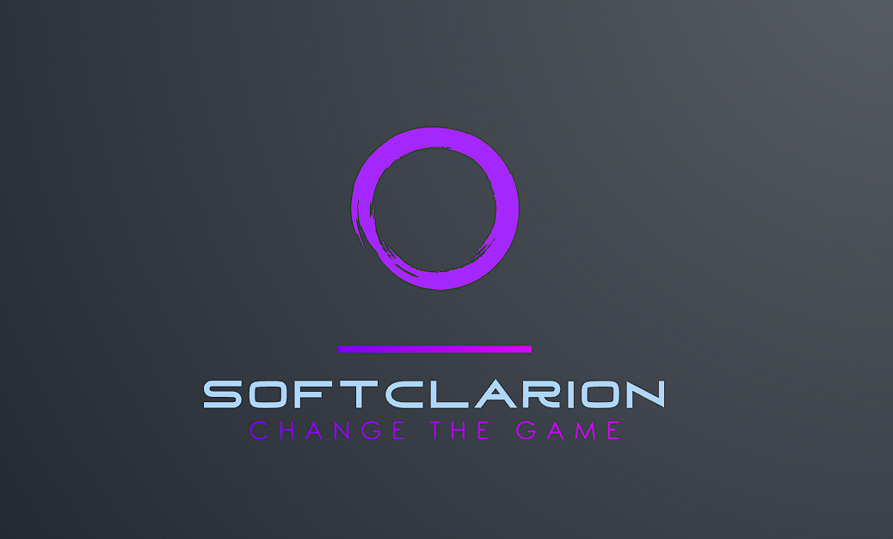
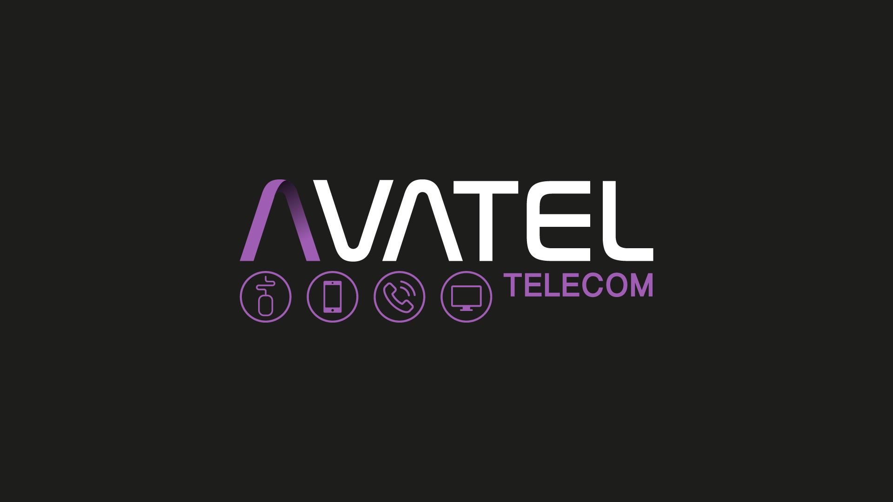

# Bienvenid@s al Github de Isabelo Castillo

### Aquí podrás observar mi enfoque en la programación y los proyectos en los que participo.
 

## 🌐 Socials:
 

Soy programador , desarrollador y analista de datos, con experiencia en el sector de las telecomunicaciones, mantenimiento, soporte y crecimiento en empresas de redes de fibra óptica. Creo software para satisfacer tanto las necesidades de los usuarios como de las empresas. Tengo amplios conocimientos en bases de datos relacionales y desarrollo de software. **Actualmente me estoy especializando en Inteligencia Artificial, Machine Learning y Deep Learning.**

- **Desarrollo**: Creación de scripts en Python mantenibles y escalables para ejecutar pruebas en equipos de red.
- **Aplicaciones**: Desarrollo de aplicaciones web, de escritorio y móviles para la gestión y automatización de procesos internos. Utilizo frameworks como Flask, Django y Kivy, siempre siguiendo las mejores prácticas.

### Aptitudes Técnicas:

### Aptitudes Sociales:

## Lenguajes de Programación:

## Herramientas y Entornos:

## Soft Skills:

## Mis Estadísticas en Github

## Contacto:

